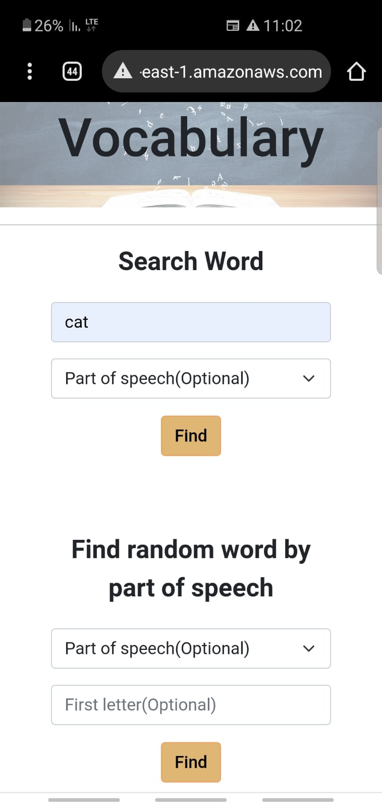
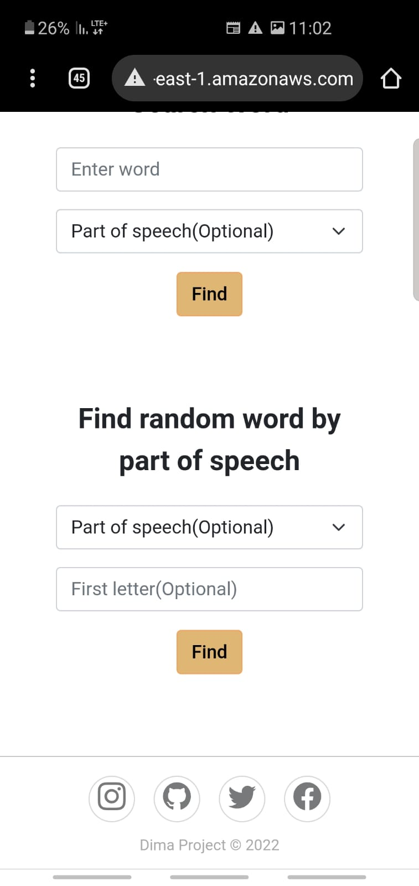
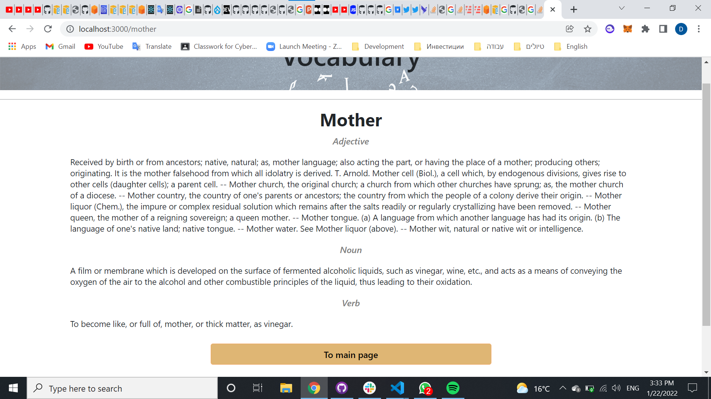
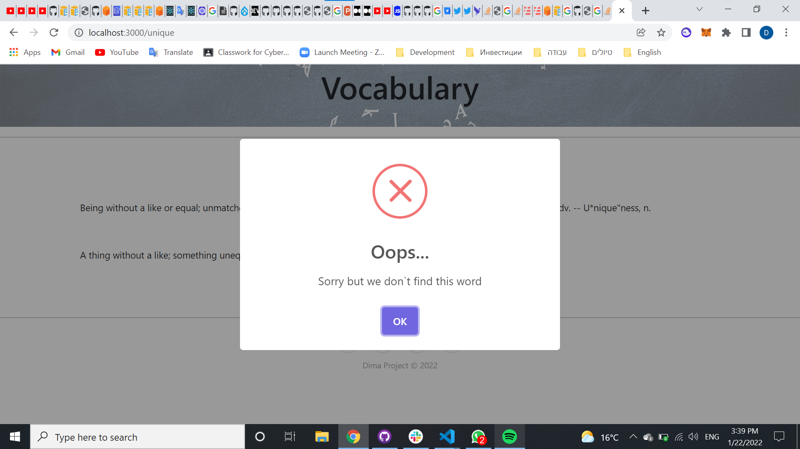

<div id="top"></div>
<!--
*** Thanks for checking out the Best-README-Template. If you have a suggestion
*** that would make this better, please fork the repo and create a pull request
*** or simply open an issue with the tag "enhancement".
*** Don't forget to give the project a star!
*** Thanks again! Now go create something AMAZING! :D
-->

<!-- PROJECT SHIELDS -->
<!--
*** I'm using markdown "reference style" links for readability.
*** Reference links are enclosed in brackets [ ] instead of parentheses ( ).
*** See the bottom of this document for the declaration of the reference variables
*** for contributors-url, forks-url, etc. This is an optional, concise syntax you may use.
*** https://www.markdownguide.org/basic-syntax/#reference-style-links
-->

[![Forks][forks-shield]][forks-url]
[![Stargazers][stars-shield]][stars-url]
[![Issues][issues-shield]][issues-url]
[![LinkedIn][linkedin-shield]][linkedin-url]

<!-- PROJECT LOGO -->
<br />
<div align="center">
<h3 align="center">Word Dictionary</h3>

  <p align="center">
    Service tha will help you to understand English more
    <br />
    <br />
    <a href="http://dima-app-dictionary.s3-website-us-east-1.amazonaws.com">View Demo</a>
    ·
    <a href="https://github.com/github_username/repo_name/issues">Report Bug</a>
    ·
    <a href="https://github.com/github_username/repo_name/issues">Request Feature</a>
  </p>
</div>

<!-- TABLE OF CONTENTS -->
<details>
  <summary>Table of Contents</summary>
  <ol>
    <li>
      <a href="#about-the-project">About The Project</a>
      <ul>
        <li><a href="#built-with">Built With</a></li>
      </ul>
    </li>
    <li>
      <a href="#getting-started">Getting Started</a>
      <ul>
        <li><a href="#prerequisites">Prerequisites</a></li>
        <li><a href="#installation">Installation</a></li>
      </ul>
    </li>
    <li><a href="#usage">Usage</a></li>
    <li><a href="#roadmap">Roadmap</a></li>
    <li><a href="#contributing">Contributing</a></li>
    <li><a href="#contact">Contact</a></li>
  </ol>
</details>

<!-- ABOUT THE PROJECT -->

## About The Project

<div>
    
    
</div  >

I decided to create dictionary, that will help to me and other people that want to learn English. So I made comfort aplication to search words and learning them meanings, also it is functionality to search random word by part of speech so you can learn every day random word.
My Database have 70.000 words and i will improve it. All words have definition and part of speech so i hope that will help to somebody to learn more efficient.

<p align="right">(<a href="#top">Back to top</a>)</p>

### Built With

- [React.js](https://reactjs.org/)
- [Typescript](https://www.typescriptlang.org/)
- [Redux](https://redux.js.org/)
- [Bootstrap](https://getbootstrap.com)
- [Jest](https://jestjs.io/)
- [Cypress](https://www.cypress.io/)

<p align="right">(<a href="#top">Back to top</a>)</p>

<!-- GETTING STARTED -->

## Getting Started

If you want to help me improve my service or you want to work with this project on your local machine. You can follow these simple steps.

### Prerequisites

This is an example of how to list things you need to use the software and how to install them.

- npm
  ```sh
  npm install npm@latest
  ```

### Installation

1. Clone the repo
   ```sh
   git clone https://github.com/DimaTomilin/dictionary-front.git
   ```
2. Install NPM packages
   ```sh
   npm install
   ```

<p align="right">(<a href="#top">Back to top</a>)</p>

<!-- USAGE EXAMPLES -->

## Usage


<br/>
It is example of WordPage that have some definitions because searched word we can use like noun,adjective and verb.
<br/>
<br/>

<br/>
In this image we can see that if i try to find word that don`t exist at the moment in my Database or i will try to make something wrong i will Have informative window that will explain what go bad.

<p align="right">(<a href="#top">Back to top</a>)</p>

<!-- ROADMAP -->

## Roadmap

- Creating webpage with functionality of seacrching by words, also make possible to search definition of this word only to one part of speech.
- Add functionality of searching random words by part of speech or spesific letter.
- Add functinality to PC users to search next word by Ctrl+Click on the word. You also have notification in the application.

See the [open issues](https://github.com/github_username/repo_name/issues) for a full list of proposed features (and known issues).

### New version 2.0

- Fixed bugs of searching word by Ctrl+Click. Now you will search word without symbols and it will work correct.
- Refactoring of application. Added Typescript and Testing. Also refactoring of folders and code structure.
- Added functionality of loading spinner and more efficient error messages.
- Added history of search.

<p align="right">(<a href="#top">Back to top</a>)</p>

<!-- CONTRIBUTING -->

## Contributing

Contributions are what make the open source community such an amazing place to learn, inspire, and create. Any contributions you make are **greatly appreciated**.

If you have a suggestion that would make this better, please fork the repo and create a pull request. You can also simply open an issue with the tag "enhancement".
Don't forget to give the project a star! Thanks again!

1. Fork the Project
2. Create your Feature Branch (`git checkout -b feature/AmazingFeature`)
3. Commit your Changes (`git commit -m 'Add some AmazingFeature'`)
4. Push to the Branch (`git push origin feature/AmazingFeature`)
5. Open a Pull Request

<p align="right">(<a href="#top">Back to top</a>)</p>

## Contact

Tomilin Dima - [@twitter_handle](https://twitter.com/TomilinDima) - tomilin.dimon@gmail.com

Also you have all my contacts in my application wegpage <a href="http://dima-app-dictionary.s3-website-us-east-1.amazonaws.com">View Demo</a>

<p align="right">(<a href="#top">Back to top</a>)</p>

<!-- MARKDOWN LINKS & IMAGES -->
<!-- https://www.markdownguide.org/basic-syntax/#reference-style-links -->

[issues-shield]: https://img.shields.io/badge/Issues-0-red
[issues-url]: https://github.com/DimaTomilin/dictionary-front/issues
[forks-shield]: https://img.shields.io/badge/Forks-0-green
[forks-url]: https://github.com/DimaTomilin/dictionary-front/network/members
[stars-shield]: https://img.shields.io/badge/Stars-0-yellow
[stars-url]: https://github.com/DimaTomilin/dictionary-front/stargazers
[linkedin-shield]: https://img.shields.io/badge/LinkedIn-LinkedIn-blue.svg?style=flat&logo=linkedin
[linkedin-url]: https://www.linkedin.com/in/dima-tomilin/
[product-screenshot]: /assets/screenshot1.jpeg
[product-screenshot2]: /assets/screenshot2.jpeg
